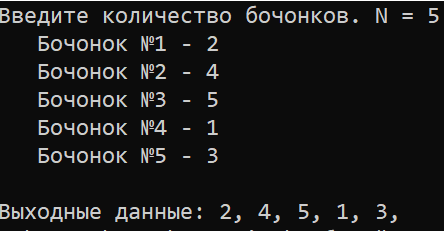
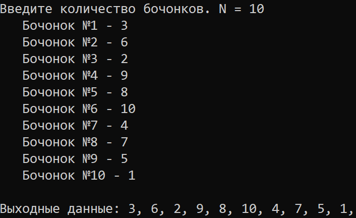
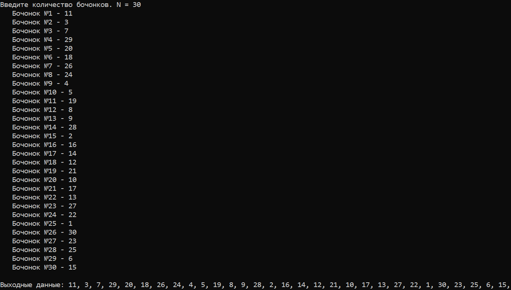

# LAB10
## ЛАБОРАТОРНЫЕ РАБОТЫ №8 и №9
#  Шахматы и логирование
# Постановка задачи:
## Написать программу для проведения жеребьевки методом генерации случайных чисел.
##В мешке с бочонками N бочек (от 1 до N).
##Нажатие кнопки – вытаскивание очередного бочонка из мешка.
##Вытянутые бочонки убираем в сторону (т.е. каждое число может выпасть только 1 раз).
# Задание:
##№1
##Написать на любом языке программу, реализующую данную задачу.
##Код программы должен содержать комментарии для созданных функций и основных блоков, а также качественный диалог с пользователем для минимизации отказов при неправильном вводе. Организовать логироаание действий пользователя и выходных данных.
##Входные данные: натуральное число N.
##Выходные данные: последовательность чисел от 1 до N в случайном порядке.
##Скомпилировать программу и предоставить для тестирования (в репозитории GitHub).
##№2      
##Создать новый репозиторий для данной программы в GitHub. В процессе написания, отладки и улучшения программы использовать git для фиксации изменений. Сопровождать коммиты понятными комментариями о том, что было сделано.
#ТЕСТЫ

##N = 5

##N = 10

##N = 30
#Результаты в текстовом документе - log.txt
### Открыть проект можно с помощью среды программирования Visual Studio 2019. Для запуска следует открывать папку проекта под названием "Lab10".
